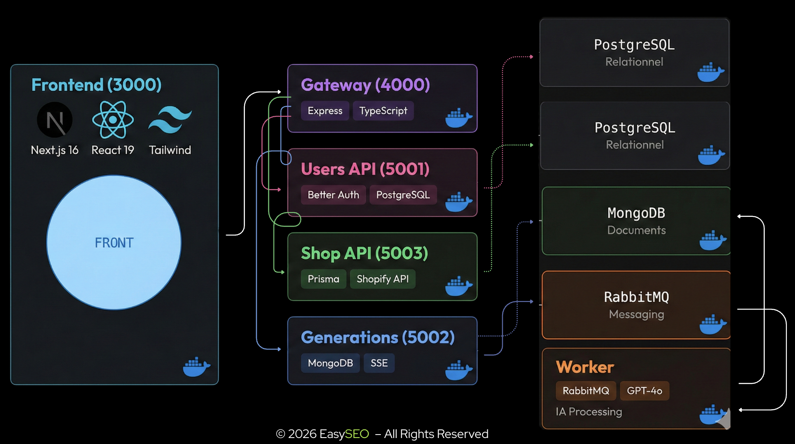

# EasySeo

**Plateforme SaaS d'automatisation de contenu SEO pour e-commerçants Shopify, basée sur une architecture Microservices.**

## 📖 À propos du projet

EasySeo est un SaaS B2B qui aide les e-commerçants Shopify à générer des fiches produits et des descriptions de collections optimisées pour le référencement (SEO) en quelques secondes grâce à l'Intelligence Artificielle.

Le marchand connecte sa boutique Shopify, configure ses paramètres SEO (niche, langue, persona client), et l'IA génère des descriptions, meta-titres, meta-descriptions et slugs optimisés pour Google.

### 🎯 Pourquoi cet outil ?

La rédaction de fiches produits est la tâche la plus chronophage et la moins aimée des e-commerçants :

1. **Le problème du temps :** Rédiger une bonne fiche prend 20 à 60 minutes. Pour une boutique de 200 produits, cela représente des semaines de travail.
2. **Le problème du SEO :** Sans optimisation sémantique, une boutique est invisible sur Google.
3. **Le problème du coût :** Embaucher des rédacteurs coûte cher.

**Notre solution :** Une interface simple où le marchand sélectionne ses produits, clique sur "Générer", et notre pipeline asynchrone (RabbitMQ + Workers) produit un contenu vendeur et optimisé SEO en temps réel via SSE.

### Concurrence

- https://describely.ai/
- https://www.kaatalog.ai/
- https://shopifast.io/landing

## 🛠 Stack Technique

### Backend

- **Express 5.1** avec **TypeScript 5.7** - API REST pour chaque microservice
- **Prisma 7.0** - ORM typé pour PostgreSQL
- **Mongoose 9.0** - ODM pour MongoDB
- **Better Auth** - Authentification (JWT, OAuth, sessions)
- **@shopify/shopify-api** - Intégration Shopify GraphQL
- **amqplib** - Client RabbitMQ pour le messaging asynchrone
- **http-proxy-middleware** - Reverse proxy pour l'API Gateway

### Frontend

- **Next.js 16** avec **React 19** - App Router, SSR
- **Tailwind CSS 4** - Classes utilitaires
- **Shadcn/ui** - Composants accessibles (Radix primitives)
- **Tiptap 3** - Éditeur de texte riche WYSIWYG
- **@tanstack/react-table** - Tables de données interactives
- **React Hook Form** + **Zod** - Formulaires et validation
- **Recharts** - Graphiques pour le dashboard
- **next-themes** - Thème sombre / clair
- **Sonner** - Notifications toast

### Intelligence Artificielle

- **OpenAI GPT-4o** - Génération de descriptions, meta-tags, slugs
- **Anthropic Claude** - Support multi-IA pour les contenus longs

### Infrastructure

- **RabbitMQ** - Broker de messages pour le traitement asynchrone des générations
- **PostgreSQL 17** - Données relationnelles (utilisateurs, boutiques, produits, collections)
- **MongoDB 8** (Replica Set) - Jobs de génération IA + Change Streams pour le SSE
- **Docker** + **Docker Compose** - Conteneurisation de tous les services
- **pnpm** - Gestionnaire de paquets avec workspaces monorepo

## 📁 Architecture



Le projet utilise une architecture microservices orientée événements :

```
Frontend (3000) → API Gateway (4000) → Users API (5001) → PostgreSQL (users_db)
                                     → Generations API (5002) → MongoDB ← Change Streams (SSE)
                                     → Shop API (5003) → PostgreSQL (seo_facile_shops)
                                     ↓
                               Generations API → RabbitMQ → Worker (x3) → OpenAI / Anthropic
                                                                        → MongoDB (update job)
```

| Service           | Port        | Base de données               | Rôle                                             |
| ----------------- | ----------- | ----------------------------- | ------------------------------------------------ |
| **Frontend**      | 3000        | -                             | Interface Next.js                                |
| **API Gateway**   | 4000        | -                             | Reverse proxy, routage, authentification          |
| **Users API**     | 5001        | PostgreSQL (`users_db`)       | Authentification, utilisateurs, sessions          |
| **Generations API** | 5002      | MongoDB (`generations-db`)    | Jobs de génération IA, streaming SSE             |
| **Shop API**      | 5003        | PostgreSQL (`seo_facile_shops`) | Boutiques Shopify, produits, collections, settings |
| **Worker** (x3)   | -           | MongoDB                       | Traitement asynchrone des générations via IA      |
| **RabbitMQ**      | 5672 / 15672 | -                            | Broker de messages                                |

### Monorepo et packages partagés

Le projet est organisé en monorepo pnpm avec des packages workspace partagés :

- **`@seo-facile-de-ouf/shared`** (`shared/`) : types TypeScript partagés entre frontend et backend (User, ShopifyProduct, ShopifyCollection, StoreSettings, Generation...)
- **`@seo-facile-de-ouf/backend-shared`** (`backend/shared/`) : utilitaires backend communs aux microservices (error middleware, gateway guard, chiffrement AES-256-GCM, factory Express, helpers controllers)

## 🚀 Installation

Le projet comprend un script `setup.sh` qui initialise le projet et configure les variables d'environnement.

```bash
chmod +x setup.sh
./setup.sh
```

Le script va :

- Créer le fichier `.env` à la racine (pour Docker Compose) depuis `env.example`
- Créer les fichiers `.env` pour chaque microservice
- Installer toutes les dépendances avec `pnpm`
- Générer les clients Prisma pour Users API et Shop API

**Note :** Les fichiers `.env` ne sont PAS versionnés (dans `.gitignore`). Seul `env.example` est commité comme template.

## 💻 Lancer le projet

### Option 1 : Avec Docker (Recommandé)

```bash
docker-compose up --build
```

Tous les services démarrent automatiquement avec hot-reload. Le worker est configuré avec 3 replicas pour le traitement parallèle des générations.

### Option 2 : En local (développement)

```bash
pnpm run dev    # Lance tous les services en mode concurrent
```

Ou individuellement :

```bash
pnpm run frontend         # Next.js (port 3000)
pnpm run api-gateway      # Express gateway (port 4000)
pnpm run users-api        # Users service (port 5001)
pnpm run generations-api  # Generations service (port 5002)
pnpm run shop-api         # Shop service (port 5003)
```

**Prérequis en local :** PostgreSQL, MongoDB (en Replica Set) et RabbitMQ doivent être installés et lancés.

## 📍 Routes disponibles

### Via API Gateway (http://localhost:4000)

#### Authentification (pas d'auth requise)

| Méthode | Route                | Description               |
| ------- | -------------------- | ------------------------- |
| POST    | `/api/auth/sign-up`  | Inscription               |
| POST    | `/api/auth/sign-in`  | Connexion                 |
| POST    | `/api/auth/sign-out` | Déconnexion               |
| GET     | `/auth/me`           | Info utilisateur connecté |

#### Boutiques (auth requise)

| Méthode | Route                       | Description                  |
| ------- | --------------------------- | ---------------------------- |
| GET     | `/stores`                   | Liste des boutiques          |
| POST    | `/stores`                   | Ajouter une boutique         |
| GET     | `/stores/:storeId`          | Détail d'une boutique        |
| PUT     | `/stores/:storeId`          | Modifier une boutique        |
| DELETE  | `/stores/:storeId`          | Supprimer une boutique       |
| GET     | `/stores/:storeId/settings` | Paramètres SEO               |
| PUT     | `/stores/:storeId/settings` | Modifier les paramètres SEO  |

#### Produits (auth requise)

| Méthode | Route                                        | Description                 |
| ------- | -------------------------------------------- | --------------------------- |
| GET     | `/shops/:shopId/products`                    | Liste des produits          |
| GET     | `/shops/:shopId/products/:productId`         | Détail d'un produit         |
| POST    | `/shops/:shopId/products/sync`               | Synchroniser depuis Shopify |
| PATCH   | `/shops/:shopId/products/:productId`         | Modifier un produit         |
| POST    | `/shops/:shopId/products/:productId/publish` | Publier sur Shopify         |

#### Collections (auth requise)

| Méthode | Route                                              | Description                 |
| ------- | -------------------------------------------------- | --------------------------- |
| GET     | `/shops/:shopId/collections`                       | Liste des collections       |
| GET     | `/shops/:shopId/collections/:collectionId`         | Détail d'une collection     |
| POST    | `/shops/:shopId/collections/sync`                  | Synchroniser depuis Shopify |
| PATCH   | `/shops/:shopId/collections/:collectionId`         | Modifier une collection     |
| POST    | `/shops/:shopId/collections/:collectionId/publish` | Publier sur Shopify         |

#### Générations IA (auth requise)

| Méthode | Route                                   | Description                      |
| ------- | --------------------------------------- | -------------------------------- |
| POST    | `/generations/generate`                 | Créer un job de génération (202) |
| POST    | `/generations/generate/bulk`            | Génération en masse (max 50)     |
| GET     | `/generations/job/:id`                  | Status d'un job                  |
| GET     | `/generations/job/:id/stream`           | Stream SSE temps réel            |
| GET     | `/generations`                          | Toutes les générations           |
| GET     | `/generations/product/:productId`       | Historique d'un produit          |
| GET     | `/generations/collection/:collectionId` | Historique d'une collection      |
| GET     | `/generations/jobs`                     | Liste avec filtres               |

## 🗄️ Bases de données

### PostgreSQL

Deux bases de données gérées via Prisma :

- **`users_db`** : utilisateurs, sessions, comptes OAuth (Better Auth)
- **`seo_facile_shops`** : boutiques, paramètres SEO, collections, produits Shopify

**Interface graphique :** Adminer à http://localhost:8082 (server: `postgres`, user: `postgres`, password: `postgres`)

**Prisma :**

```bash
cd backend/users-api && pnpm prisma:generate && pnpm prisma:push
cd backend/shop-api && pnpm prisma:generate && pnpm prisma:push
```

### MongoDB

Une base **`generations-db`** contenant les jobs de génération IA. Configurée en **Replica Set** (obligatoire pour les Change Streams utilisés par le SSE).

**Interface graphique :** Mongo Express à http://localhost:8081

### RabbitMQ

Broker de messages pour la queue `ai-generation-jobs`. Les workers (3 replicas) consomment les messages avec `prefetch: 1`.

**Interface graphique :** http://localhost:15672 (user: `guest`, password: `guest`)

## 🔧 Configuration

Les variables d'environnement sont dans les fichiers `.env` de chaque service. Des fichiers `.env.example` sont fournis comme templates.

### Variables critiques

| Variable             | Service(s)                           | Description                          |
| -------------------- | ------------------------------------ | ------------------------------------ |
| `GATEWAY_SECRET`     | API Gateway + microservices          | Secret partagé pour le gateway guard |
| `BETTER_AUTH_SECRET` | Users API                            | Signature des JWT                    |
| `ENCRYPTION_KEY`     | Shop API                             | Chiffrement AES-256-GCM des credentials Shopify |
| `DATABASE_URL`       | Users API, Shop API                  | URI PostgreSQL                       |
| `MONGO_URI`          | Generations API, Worker              | URI MongoDB                          |
| `RABBITMQ_URL`       | Generations API, Worker              | URI RabbitMQ                         |
| `OPENAI_API_KEY`     | Worker                               | Clé API OpenAI                       |
| `ANTHROPIC_API_KEY`  | Worker                               | Clé API Anthropic                    |
| `FRONTEND_URL`       | Tous les backends                    | URL du frontend pour CORS            |

## 📝 Notes

- En **Docker** : les services utilisent les noms de conteneurs (`http://users-api:5001`, `http://shop-api:5003`)
- En **local** : les services utilisent `localhost` (`http://localhost:5001`, `http://localhost:5003`)
- Le script `setup.sh` configure automatiquement les `.env` pour Docker
- La documentation technique complète est disponible dans [`docs/documentation-technique.md`](docs/documentation-technique.md)
