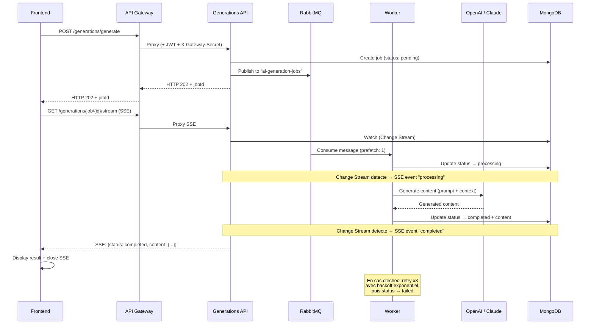

## Flux de generation IA (asynchrone)

```mermaid
sequenceDiagram
    participant FE as Frontend
    participant GW as API Gateway
    participant GA as Generations API
    participant RMQ as RabbitMQ
    participant W as Worker
    participant AI as OpenAI / Claude
    participant DB as MongoDB

    FE->>GW: POST /generations/generate
    GW->>GA: Proxy (+ JWT + X-Gateway-Secret)
    GA->>DB: Create job (status: pending)
    GA->>RMQ: Publish to "ai-generation-jobs"
    GA-->>GW: HTTP 202 + jobId
    GW-->>FE: HTTP 202 + jobId

    FE->>GW: GET /generations/job/{id}/stream (SSE)
    GW->>GA: Proxy SSE
    GA->>DB: Watch (Change Stream)

    RMQ->>W: Consume message (prefetch: 1)
    W->>DB: Update status → processing
    Note over GA,DB: Change Stream detecte → SSE event "processing"

    W->>AI: Generate content (prompt + context)
    AI-->>W: Generated content

    W->>DB: Update status → completed + content
    Note over GA,DB: Change Stream detecte → SSE event "completed"

    GA-->>FE: SSE: {status: completed, content: {...}}
    FE->>FE: Display result + close SSE

    Note over W: En cas d'echec: retry x3<br/>avec backoff exponentiel,<br/>puis status → failed
```
