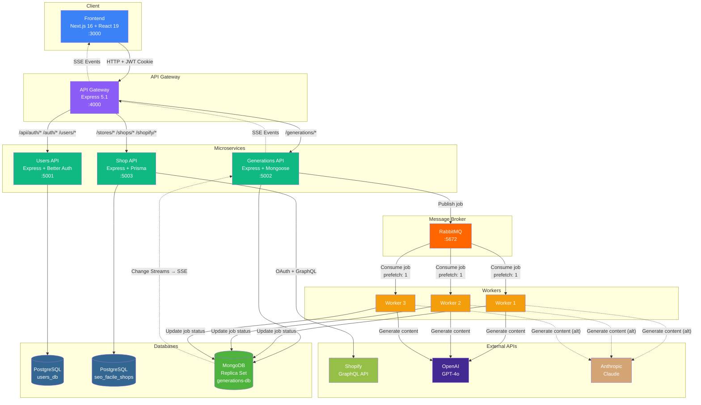

## Architecture globale

```mermaid
graph TB
    subgraph Client
        FE["Frontend<br/>Next.js 16 + React 19<br/>:3000"]
    end

    subgraph API Gateway
        GW["API Gateway<br/>Express 5.1<br/>:4000"]
    end

    subgraph Microservices
        UA["Users API<br/>Express + Better Auth<br/>:5001"]
        GA["Generations API<br/>Express + Mongoose<br/>:5002"]
        SA["Shop API<br/>Express + Prisma<br/>:5003"]
    end

    subgraph Workers
        W1["Worker 1"]
        W2["Worker 2"]
        W3["Worker 3"]
    end

    subgraph Databases
        PG_U[("PostgreSQL<br/>users_db")]
        PG_S[("PostgreSQL<br/>seo_facile_shops")]
        MONGO[("MongoDB<br/>Replica Set<br/>generations-db")]
    end

    subgraph Message Broker
        RMQ["RabbitMQ<br/>:5672"]
    end

    subgraph External APIs
        SHOPIFY["Shopify<br/>GraphQL API"]
        OPENAI["OpenAI<br/>GPT-4o"]
        ANTHROPIC["Anthropic<br/>Claude"]
    end

    FE -->|"HTTP + JWT Cookie"| GW

    GW -->|"/api/auth/* /auth/* /users/*"| UA
    GW -->|"/generations/*"| GA
    GW -->|"/stores/* /shops/* /shopify/*"| SA

    UA --> PG_U
    SA --> PG_S
    GA --> MONGO
    SA -->|"OAuth + GraphQL"| SHOPIFY

    GA -->|"Publish job"| RMQ
    RMQ -->|"Consume job<br/>prefetch: 1"| W1
    RMQ -->|"Consume job<br/>prefetch: 1"| W2
    RMQ -->|"Consume job<br/>prefetch: 1"| W3

    W1 & W2 & W3 -->|"Update job status"| MONGO
    W1 & W2 & W3 -->|"Generate content"| OPENAI
    W1 & W2 & W3 -.->|"Generate content (alt)"| ANTHROPIC

    MONGO -.->|"Change Streams → SSE"| GA
    GA -.->|"SSE Events"| GW
    GW -.->|"SSE Events"| FE

    style FE fill:#3b82f6,color:#fff
    style GW fill:#8b5cf6,color:#fff
    style UA fill:#10b981,color:#fff
    style GA fill:#10b981,color:#fff
    style SA fill:#10b981,color:#fff
    style W1 fill:#f59e0b,color:#fff
    style W2 fill:#f59e0b,color:#fff
    style W3 fill:#f59e0b,color:#fff
    style PG_U fill:#336791,color:#fff
    style PG_S fill:#336791,color:#fff
    style MONGO fill:#4db33d,color:#fff
    style RMQ fill:#ff6600,color:#fff
    style SHOPIFY fill:#96bf48,color:#fff
    style OPENAI fill:#412991,color:#fff
    style ANTHROPIC fill:#d4a574,color:#fff
```
