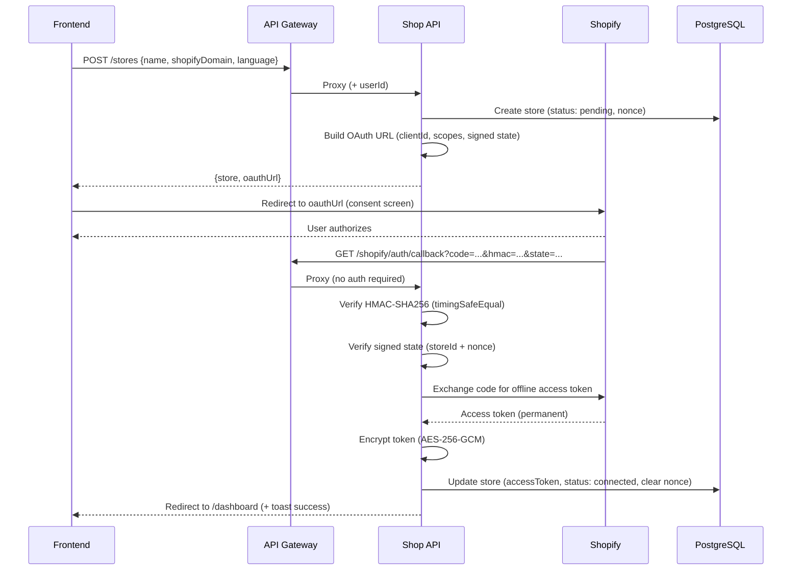

## Flux OAuth Shopify

```mermaid
sequenceDiagram
    participant FE as Frontend
    participant GW as API Gateway
    participant SA as Shop API
    participant SH as Shopify
    participant DB as PostgreSQL

    FE->>GW: POST /stores {name, shopifyDomain, language}
    GW->>SA: Proxy (+ userId)
    SA->>DB: Create store (status: pending, nonce)
    SA->>SA: Build OAuth URL (clientId, scopes, signed state)
    SA-->>FE: {store, oauthUrl}

    FE->>SH: Redirect to oauthUrl (consent screen)
    SH-->>FE: User authorizes
    SH->>GW: GET /shopify/auth/callback?code=...&hmac=...&state=...
    GW->>SA: Proxy (no auth required)

    SA->>SA: Verify HMAC-SHA256 (timingSafeEqual)
    SA->>SA: Verify signed state (storeId + nonce)
    SA->>SH: Exchange code for offline access token
    SH-->>SA: Access token (permanent)
    SA->>SA: Encrypt token (AES-256-GCM)
    SA->>DB: Update store (accessToken, status: connected, clear nonce)
    SA-->>FE: Redirect to /dashboard (+ toast success)
```
